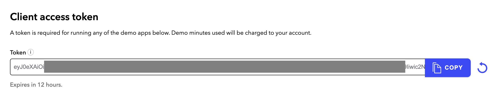
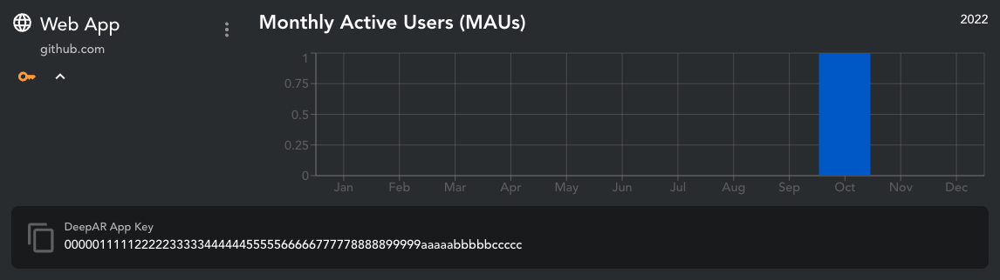

# Blog post - Send a custom video with the Dolby.io Web SDK and DeepAR.io

This repository contains a sample application for the blog post {INSERT BLOG POST NAME}. It allows you to use [DeepAR](https://deepar.io) to create custom video filter and inject them into a Dolby.io conference.

## Requirements

If you do not have one already, create an account on Dolby.io and retrieve a client access token by connecting to your dashboard and selecting your application then click on Demos in the left menu.



Then, create a [DeepAR](https://deepar.io) account if you do not have one already and connect to your dashboard, create a project and get your `DeepAR App Key`.



## Run the application

Because this SDK is using WASM (Web Assembly) code, it must run from a web server. You web browser might prevent the web application from running by simply opening the HTML file from the file system. A quick solution if you want to test your application from a local machine is to use [express](https://www.npmjs.com/package/express). After you clone this repo, run the following command to install `express`.

```bash
# Install the NPM packages
npm install
```

Run the web server using Node.JS.

```bash
node .
```

You can now open your web browser at http://localhost:3000, provide your DeepAR license key as well as the Dolby.io client access token that you can get from the dashboard.
